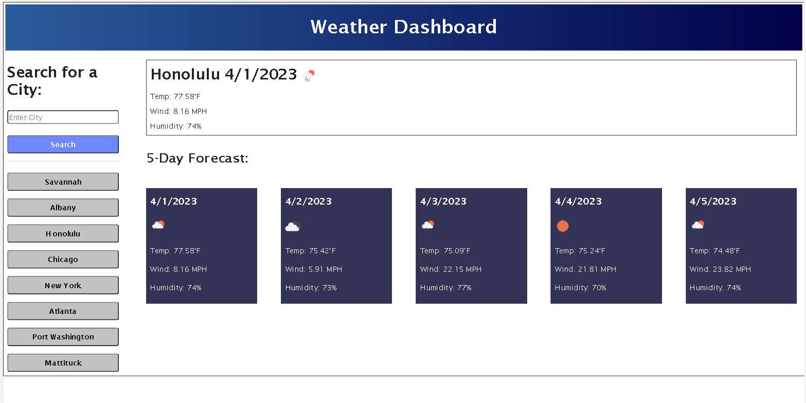

# Weather Dashboard 

## Description

This web application is a weather forecast search utilizing OpenWeather API.

Weather forecast information for a user inputted city is displayed via 5 forecast cards.

This project demonstrates usage of api calls using fetch commands to retrieve data from the OpenWeather API and parse through it in order to display the intended weather information for the next 5 days.

[GitHub Repo](https://github.com/edrezner/Weather-Dashboard)

[Website](https://edrezner.github.io/Weather-Dashboard/)

Preview Image:

## Usage

When the webpage loads, the first 8 searches from previous uses will be loaded as search history buttons on the side of the page. Enter in a city name and click search to get the next 5 days weather forecast.

If your search is not already in the history, a new button will be added to the sidebar; the buttons on the sidebar can be clicked to display the forecast data for the indicated city. 

## Known Issues

The returned data object from OpenWeather API contains an arrays within an array that has the needed weather data for forecasts. Each day has 39 three hour blocks of data. In order to have 5 cards the current day is included in the 5 day forecast. 

## Credits 

1. Natasha Mann - Suggested some jQuery to eliminate some extraneous code in vanilla JavaScript.